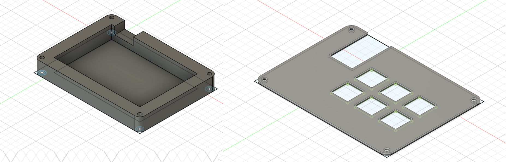
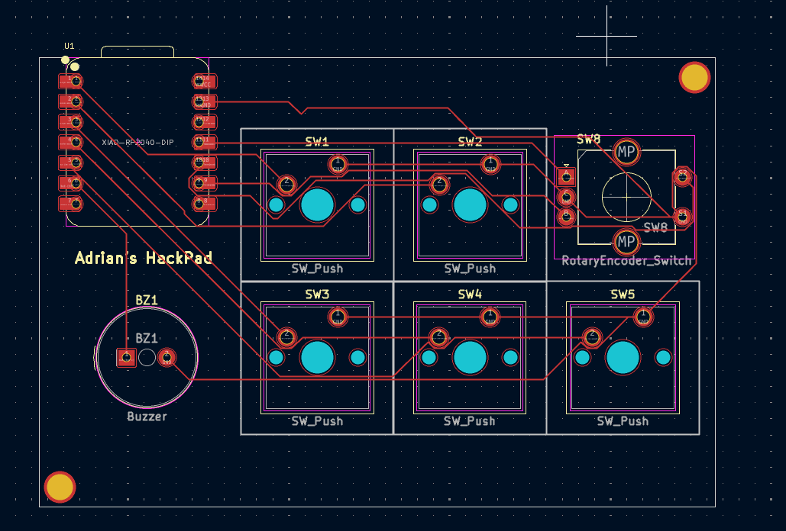

# Adrian-s-HackPad
This is a custom macro pad based on the Seeed XIAO RP2040, It features dedicated macro keys, a rotary encoder for volume control, and addressable RGB LEDs for visual feedback.
# Overall View

This hackpad includes:

- 5 macro keys

- 1 rotary encoder

- 8 addressable RGB LEDs

#  Schematic

Components:

- MCU: Seeed XIAO RP2040

- Keys: Connected directly to GPIO pins

- Rotary Encoder:

- RGB LEDs

# PCB

The PCB was designed to be:

Single-board, compact layout

# Case & Assembly

The case is designed to:

Secure the PCB with screws

Allow RGB light diffusion

Expose the USB port cleanly

# ⌨️ Firmware & Key Functions
Arduino Code

Keys

Win + D → Show Desktop

Ctrl + Shift + Esc → Task Manager

Win + E → File Explorer

Win + L → Lock Windows

Alt + F4 → Close active window

Encoder

Rotate clockwise → Volume Up

Rotate counter-clockwise → Volume Down

Press encoder → Mute

# Bill of Materials (BOM)
Qty	Component	Description
- 1	Seeed XIAO RP2040	Microcontroller board
- 5	Mechanical switches	MX-style or compatible
- 1	Rotary encoder	With push button
- 8	WS2812B LEDs	Addressable RGB LEDs
- 1	PCB	Custom designed
- 1	Case	3D printed or CNC
- 1	Encoder knob	Any compatible knob
- 5	Keycaps	1u keycaps
- 1	USB cable	USB-C (or as needed)
